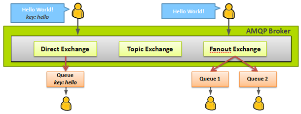

# AMQP

### [Advanced Messaging & Routing with AMQP](http://www.igvita.com/2009/10/08/advanced-messaging-routing-with-amqp/)
By Ilya Grigorik on October 08, 2009

Not all message queues are made equal. In the simplest case, a message queue is synonymous with an asynchronous protocol in which the sender and the receiver do not operate on the message at the same time. However, while this pattern is most commonly used to decouple distinct services (an intermediate mailbox, of sorts), the more advanced implementations also enable a host more advanced recipes: load balancing, queueing, failover, pubsub, etc. AMQP can do all of the above, and yesterday's announcement of RabbitMQ 1.7 (an open source AMQP broker) warrants a closer look.

Originally developed at JP Morgan as a vendor neutral wire and broker protocol, AMQP ([Advanced Message Queuing Protocol](http://en.wikipedia.org/wiki/Advanced_Message_Queuing_Protocol)) is, in fact, a general purpose messaging bus. The protocol itself is still under active development, but there are a variety of open source client and server implementations for it, as well as some big commercial supporters (RedHat, Microsoft, etc). In other words, it works, it is production ready, and I can vouch for it from personal experience - we stream tens of millions of messages through AMQP at PostRank on a daily basis.

#### AMQP vs XMPP: Features & Architecture

The AMQP vs XMPP debate has been [raging](https://stpeter.im/index.php/2007/12/07/amqp-and-xmpp/) [for](http://saladwithsteve.com/2007/08/future-is-messaging.html) [years](http://www.opensourcery.co.za/2009/04/19/to-amqp-or-to-xmpp-that-is-the-question/) now. On the surface they both look identical, but in reality there are a number of important distinctions. For example, presence is one of the central components of XMPP, but it is not part of the AMQP specification. XMPP uses XML, whereas AMQP has a binary protocol. AMQP has native support for a number of delivery use cases (at least once, exactly once, select subscribers, persistence, etc) and also a variety of exchange implementations which allow fine-grained control to where and how the messages are routed.

#### Publishing & Consuming AMQP in Ruby

The type of exchange, message parameters, and the name of the attached queue can all contribute to the delivery and routing behavior of the message. However, for the sake of example, let's create a simple pubsub fanout exchange in Ruby:

    require 'amqp'
    
    AMQP.start(:host => 'localhost') do
      # create a fanout exchange on the broker
      exchange = MQ.new.fanout('multicast')
    
      # publish multiple messages to fanout
      exchange.publish('hello')
      exchange.publish('world')
    end
In order to consume the messages from an exchange the consumer needs to create a queue and then bind it to an exchange. A queue can be durable (survive between server restarts), or auto-deletable for cases when the queue should disappear if the consumer goes down. Best of all, once the queue is bound to an exchange, the messages are streamed to the client in real-time via a persistent connection (no polling!):

    require 'amqp'
    
    AMQP.start(:host => 'localhost') do
      amq = MQ.new
    
      # bind 'listener' queue to 'multicast' exchange
      amq.queue('listener').bind(amq.fanout('multicast')).subscribe do |msg|
        puts msg # process your message here
      end
    end
    amqp.git - AMQP client implementation in Ruby/EventMachine

## Ruby
### [Carrot](https://github.com/famoseagle/carrot)
This client does not use eventmachine so no background thread necessary. As a result, it is much easier to use from script/console and Passenger.

Example
    require 'carrot'
    
    q = Carrot.queue('name')
    10.times do |num|
      q.publish(num.to_s)
    end
    
    puts "Queued #{q.message_count} messages"
    puts
    
    while msg = q.pop(:ack => true)
      puts "Popping: #{msg}"
      q.ack
    end
    Carrot.stop

