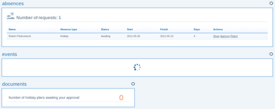

# Apotomo - [API done right](http://blog.robert.pankowecki.pl/)
During the wroc_love.rb conference I had the opportunity to speak with Nick Sutterer (the original author and maintainer of great Cells and Apotomo gems) and thank him for the architectural choices made for the libraries. He said that I should blog about and help spread the good word instead of just telling him about the things that I like. So, here I am writing this post and keeping my promise.

The architectural choices are not obvious when reading Apotomo tutorial and probably they don't bring so much to most users of the library. Nevertheless they were extremely important to me. If you are not familiar with apotomo, just jump to the official website and [Apotomo tutorial](http://apotomo.de/peters-guide-1.1/introduction.html) to get an idea of how it works.

Here is a little example of what we used apotomo widgets for:

Conceptually in apotomo it all starts in a controller.

view `rawabsence_controller.rb`

    class AbsenceController < ApplicationController
      has_widgets do |root|
        root << widget("absence/absences",  "absence_absences")
        root << widget("absence/events",    "absence_events")
        root << widget("absence/documents", "absence_documents")
      end
    end

But that's a very simple and basic thing you can do with apotomo. It all becomes much more interesting when you realize that the proc used by `has_widgets` method is not executed once but instead every time there is a request going to the controller. It is executed in scope of controller instance using `instance_eval` instead of being executed once during class loading with `class_eval`. And that gives a lot more opportunities and flexibility.

In my project every user was given some roles (like Admin, Chef, Vice-Chef) and widgets belonged to those roles. `UserRoles` and `RoleWidgets` was dynamically stored and retrieved to/from database and the UI changed accordingly. Even such details like widget width (100% vs 50%), position (left vs right) and their order could be configured per every role on database.

view `rawabsence_controller.rb`

    class AbsenceController < ApplicationController
      has_widgets do |root|
        current_role.widgets_for(current_user).each do |widget|
          root << widget(widget.path, widget.css, :position => widget.position)
        end
      end
    end

view `rawwidget.rb`

    class Absence::BasicWidget < Apotomo::Widget

      helper do
        def widget_div(options={}, &block)
          options[:class] = Array.wrap( options[:class] )
          options[:class] << :widget
          options[:class] << options[:position]
          super 
        end
      end
    
    end

So, what's the moral of the story ? Please try to design your API with flexibility in mind. It might be quite easy to achieve it if you create new object every time it is needed and use `instance_eval` instead of doing all the meta-programming once with `class_eval` when loading the class for the first time. And if you worry about performance, please don't. Many times the bigger possibilities out-stand the probably negligible performance hit.

## How to `override url_for_event` in Apotomo to always include a parameter?

To get to run Cucumber with my app and subdomains, I read that I should add default parameters to the default_url_options.

However, I can't seem to find a way to add default parameters to the url_for_event helper that Apotomo gives. I believe this would be the first (if not the only) step to getting integration tests, Apotomo, and subdomains to work.

I got an [answer from Paul Hagstrom in the Apotomo mailing list](http://groups.google.com/group/cells-and-apotomo/browse_thread/thread/fdc695115a414855):

    class YourBaseWidget < Apotomo::Widget 
      def default_url_options 
        ... 
      end 
    end 

    class YourOtherWidgets < YourBaseWidget 
      ... 
    end

This works a lot like how most of your Rails controllers inherit from ApplicationController. Thus, anything you apply to ApplicationController will apply, by inheritance, to your child controllers.

## Integrating apotomo with RefineryCMS pages
I'd like to extend RefineryCMS's PagesController to use some apotomo widgets in our project.

I could potentially do an "override" of the PagesController, which copies it into my project, but I'm using another engine that extends the PagesController (modifying the show and home methods using a module/monkey patching approach) I'd rather avoid that.

My initial approach was something like this:

in `config/application.rb`:

    config.before_initialize do
      require 'pages_controller_extensions'
    end
    
    config.to_prepare do
      PagesController.send :include, Refspike::Extensions
    end

In `pages_controller_extensions`:

    module Refspike
      module Extensions
        class << PagesController
          include Apotomo::Rails::ControllerMethods
          has_widgets do |root|
            root << widget(:map)
          end
        end
      end
    end

Unfortunately this blows up on the line "`helper ActionViewMethods`" in apotomo's `controller_methods`. Adding include Apotomo::Rails::ActionViewMethods didn't help.

I presume I'm just getting a basic detail about rails dependency management or maybe ruby open classes wrong. Is there an alternative approach, or something simple I'm overlooking?

Here's the solution. Remove the `before_initialize` stuff; there's simply no need for this to be in a module. In `application.rb`, do:

    config.to_prepare do
      ::PagesController.send :include, Apotomo::Rails::ControllerMethods
      ::PagesController.has_widgets do |root|
        root << widget(:map)
      end
    end

Then, override refinery's `shared/_content_page.html.erb` to include:

    <%=render_widget :map %>

Done and done.

What was wrong before? Well, calling `::PagesController.send :include`, `Refspike::Extensions` means that I'm actually "almost" in the scope of the class I'm trying to modify, but not quite. So, reopening the class is unnecessary, for one thing. But an ActiveSupport method, `class_inheritable_array` being called by apotomo, apparently isn't discoverable in my module scope, either, so I can't get away with doing something like:

doesn't work

    module Refspike
      module Extensions
        include Apotomo::Rails::ControllerMethods
        has_widgets do |root|
          root << widget(:map)
        end
      end
    end

Fortunately, the 4 lines of code in the application.rb are a simpler solution, and that does the trick for me.

