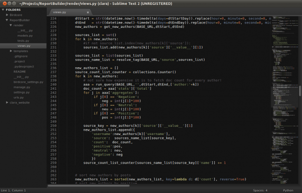
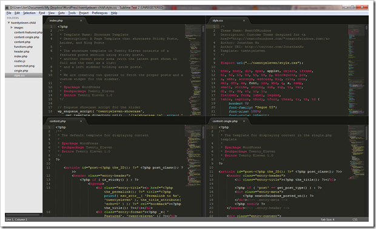
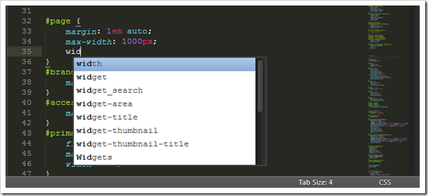
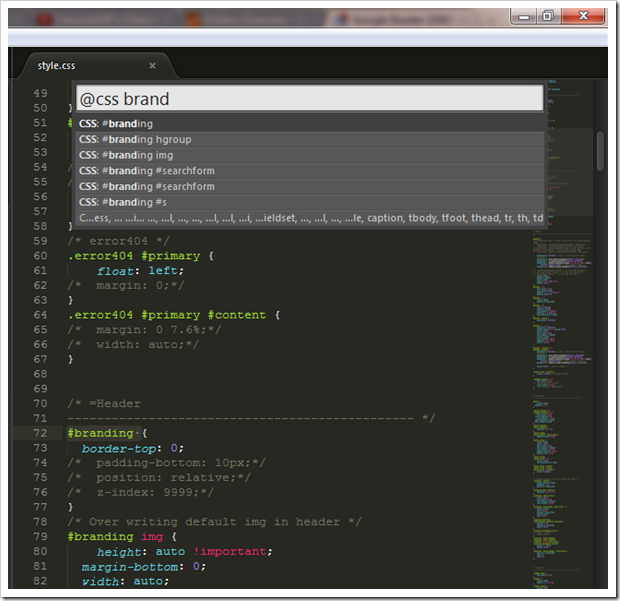
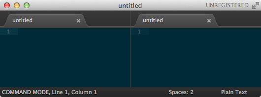
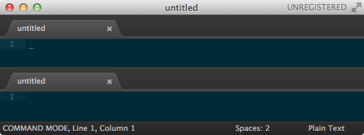
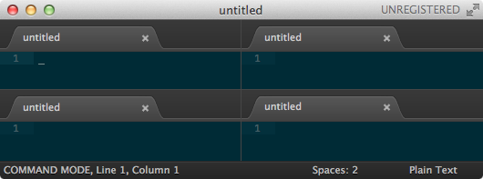
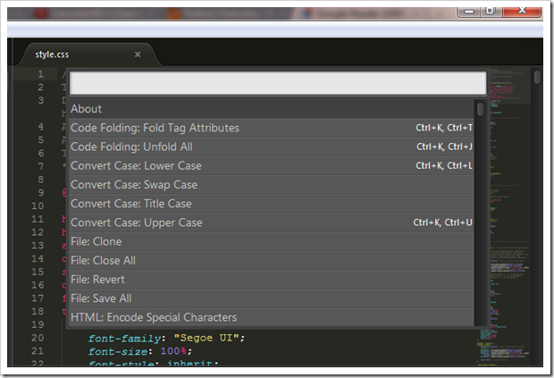
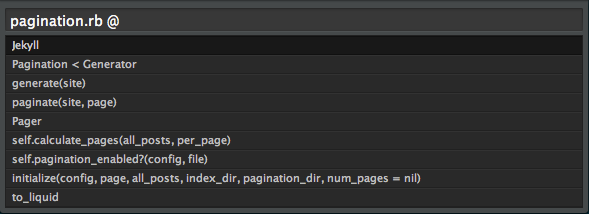
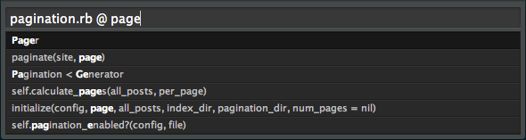

##My new funky editor. A story about Sublime Text 2
Posted: Fri, 20 Jan 2012 15:49:51 +0000

####A prologue
Today, I use [Sublime Text 2](http://www.sublimetext.com/) for just about all my text editing needs. It is fast and fairly stable. It is customizable and it can use plugins from Textmate. It also allows me to have split windows and its concept for finding files, methods, and editor actions make me a productive developer.

Over the years, I’ve used a myriad of text editors. Most of my time has been spent in Vim. My fingers are so used to Vim’s modal editing, I tend to expect the world to move up or down when I press j or k. Every time I’ve tried out new editors, I’ve always missed h/j/k/l. Sublime Text 2′s Vintage editing mode satisfies most of my modal editing needs. All the important commands are there, and new ones are added as users request them.

One big issue I’ve had with editors that can be extended by code, is that the language used for extension isn’t very friendly. I’m not well versed in Lisp, but I can get around. Emac’s ability to be customized is unsurpassed, but personally I don’t feel that I need a complex environment with an editor as a bonus. Most times I just want to create text. On the other hand, Emac’s Org Mode is unsurpassed, so I do find myself wishing that it existed in other places with the same amount of functionality as the the original.

Vim’s vimscript is more than functional. It can be used to create some truly useful plugins. Tim Pope has proven this time and time again. The problem with vimscript is that is really only useful inside of vim. Vim also allows you to extend it using other languages, such as Python and Ruby, but I haven’t explored either of those enough to comment on them.

I tried Sublime Text 2 as a diversion from my normal editor, MacVim. I’d been hearing many things about it, so I wanted to try it out. It passed the 5 minute red face test with ease, so I decided to use it exclusively for a two week period. That was over a month ago, and now I’ve purchased it as well.

# Pros and cons to RubyMine and TextMate, Sublime Text 2

I need to move to a "serious" Ruby (on Rails) IDE now that Netbeans is discontinuing Ruby support. I don't want to start a trolling war, but could I'd love to hear the pros and cons of using TextMate or RubyMine as an IDE, to help me choose which I should invest my time in, especially from people who are using one of them daily ("in the trenches").

## Requirements
- True Graphical environment
- Strong keyboard support
- Project file browser
- Snippets support
- Language support

###text-editors -- vs -- IDEs:
- text-editors 
	- Faster
	- More customizable, - can be configure to fit your specific needs more so than an IDE.
- IDEs
	- slow and bloated, not as lightweight
	- consume more power/memory and resources in general
	- This difference means a lot when you want to work with languages like Java, that has a lot of syntactic bagage, which is more productive with good IDE support

####Eclipse (IDE)
####RubyMine (IDE)

- Pros:
	- Frequent updates
	- Ruby/Rails focused, plus built-in support for common gems
	- It's actually an IDE.
	- Autocomplete 
	- Great refactoring tools
	- Good VCS (GIT specially) integration.
- Cons: 
	- Things like refactoring/autocomplete are easy to confuse (I've been trying the RubyMine trial for the last few days)
	- It's actually an IDE
		
	- It can stall from time to time

####TextMate

- Pros: 
	- Seems to be the de facto standard
	- supports a BIG list of languages
 	- is the choice of most serious Rails devs.
- Cons: 
	- it is only for OSX. 
	- I'm a bit concerned that updates are few and far between
	- I come from a Java background, so such a lightweight editor (rather than a heavyweight IDE) would be a bit of a culture-shock to me

####Sublime Text 2. 
[Sublime Text 2](http://www.sublimetext.com/2) is a cross platform text editor for Windows, Mac and Linux.

At first glance, this editor is beautiful. It has the prettiest indent guides I’ve ever seen and lovely syntax highlighting. It has an excellent set of themes including the full set of tomorrow night themes which I used the most at the time. It is also a highly extensible editor. Plugins are written in Python and aren’t very difficult to write if you can read an existing plugin or manage to find up-to-date information about them. 

- Pros:
	- It also has support for most TextMate snippets, themes, etc. 
	- it’s interface to be simple, clean, and yet still beautiful. 
	- Everything can be done from the keyboard. Everything can be done from the mouse too, but I found that doing everything from the keyboard is both faster and doesn’t break the flow of what I’m working on. 
	- The default color scheme is a sane, dark theme. Code colors and highlights are simple and clear.
	-  parenthesis (or other paired punctuation)?  created in pairs and cursor placed between them! I start typing out my functions and it indents perfectly. It recognizes my statements and indents appropriately.
	- **Really Freaking Fast** - Opens practically instantly. Files open instantly. In fact, everything happens instantly – even inside a virtual machine running on a 3 year old laptop. There are no pauses for anything to be indexed, and I’ve never seen CPU usage spike. And if a plugin slows things down at all, Sublime Text 2 tells you which one is the culprit so that you can go and disable it. I’d compare the importance of the speed difference to switching from a hard disk to an SSD. You don’t realise how much you’re waiting for your slow Java-based IDE until you use something that’s properly fast. 
	- It renders fonts properly – Droid Sans Mono and Ubuntu Mono in particular both look gorgeous – and even after a long day of use, my eyes don’t feel like they’ve been scratched on the inside by sharpened kitty claws all day long
>Dear Java, the 1990′s called and asked for their crappy non-aliased font renderer back. I think Windows 3.11 is missing it terribly.

	-  I created a symlink (like `“sudo ln -s /home/shepbook/Sublime\ Text\ 2/sublime_text /usr/bin/subl`”) and I can start it with my **ALT+F2** run command option in Gnome, just by typing in “`subl`” (of course, one could do this from your terminal as well). Even better, I can open a folder in the same way, like “`subl /path/to/folder`” and Sublime Text opens it in the left side bar.
	- All of the searching is based on an extremely powerful fuzzy matching approach
	- Magical “GoTo Anything” search - 
	> Press CTRL+P and you get this handly little drop down box. Start typing and you can search for any file in your project. It searches for both filenames and complete paths. Then, once you find the file, you can type “@” and it give you a list of all the methods in the file. Need to jump to a line in that file? Some Vim awesomeness has carried over (since it was originally inspired by Vim)… just CTRL+P and then type “:” followed by the line number.
	
	- Sublime Package Control There’s a thing called “Package Control” for Sublime Text and it makes installing plugins and extensions a piece of cake.
	- Git Control
	- There’s a healthy [ecosystem of plugins](http://wbond.net/sublime_packages/community) for it – over 200 plugins and counting – thanks to Will Bond’s Package Control package manager.  There are lots more plugins, which warrent your looking through them. There’s a linter, code completion, word highlights.
	- Simple Configuration; There are no crazy menus or configuration tools you have to nagivate through, in order to customize Sublime Text 2. Instead, everything is easily configured in simple text files. While some may not consider this “easier”, it is simpler. 
	- It strips trailing spaces from the ends of lines when saving files.
	- I can own the tool, and set it up to suit my approach to programming. Because extending the editor is so effortless, I can automate anything that I want, to suit exactly how I want it done. I can create snippets, intelligent macros, and full-blown plugins to suit, and I can make them as and when some new need occurs
- Cons;
	- It’s a closed-source product
	- It isn't free
	- it doesn’t support interactive debuggers
	- Auto-completion isn’t anything like what you’re used to in IDEs. The built-in auto-completion is based on a mix of static knowledge of languages and fuzzy matching against what you’ve recently typed. There’s no obvious intelligence about the code you’re working on, nor the parameters for any method or function.

⏎
#### Package Control

Any editor worth its salt supports a vast array of add-ons and plug-ins. Sublime Text 2 is no different. A full-featured package manager is available that helps managing and discovering new packages.

#####Installation

Install [Sublime Package Control](https://packagecontrol.io/installation) here.

#####Usage

Once you’ve restarted Sublime Text 2 you are ready to install some packages.

Open the Command Palette (⌘⇧P) and begin typing Package Control to see a list of available commands. Select the Package Control: Install Package option and press ⏎.

Use your arrow keys or start typing to find packages to install. Once you found a package press ⏎ to install it.

Here’s a list of great packages to get started with:
#### Starting packages;
- [BracketHighlighter](https://github.com/facelessuser/BracketHighlighter)
- [CoffeeScript](https://github.com/jashkenas/coffee-script-tmbundle)
- [FileDiffs](https://github.com/colinta/SublimeFileDiffs)
- [Git](https://github.com/kemayo/sublime-text-2-git)
- [Haml](https://github.com/phuibonhoa/handcrafted-haml-textmate-bundle)
- [Nettuts+ Fetch](http://net.tutsplus.com/articles/news/introducing-nettuts-fetch/)
- [Rails Related Files](http://luqmanamjad.com/)
- [RSpec (snippets and syntax)](https://github.com/rspec/rspec-tmbundle)
- [SCSS](https://github.com/kuroir/SCSS.tmbundle)
- [SideBarEnhancements](http://www.sublimetext.com/forum/viewtopic.php?f=5&t=3331)
- [ToggleQuotes](https://github.com/spadgos/sublime-ToggleQuotes)

####Grid view and Multi Column View

You can re-arrange your workspace, into grid views, or multi column views up to 4 columns. And you can do that all with keyboard shortcuts.

Besides all the time I save by using it, it simply makes coding better. 

####Autocomplete

Who says auto complete can only be alive in IDE ? This awesome text editor automatically detects the language of your file, and it gives you a list of suggestions (autocomplete) as you type. Very smart and very handy.

####Method Lookup

Function/Symbol/Method look up. You can press Control + R to launch this quick searching bar to find all the method or symbol or function that you have in your documents. Depending on the language it gives you a list of all the key functions that are in the file, again, another very handy feature to have.

#####Multi-Selection

Although vertical selection is nothing new, Sublime Text 2’s multi-selection takes it to another level. You effectively have multiple cursors on a single page.

To enabled multi-selection, you have the following options:

- Hold down ⌘ and then click everywhere you require a cursor.
- Select a block of lines and then press ⌘⇧L.
- Place the cursor over a word and press ⌘D repeatedly to select additional occurrences of that word.
- Alternatively, pressing ⌘^G will select all occurences of that word.

#####Split Screen

Simply, a MUST have! By pressing a few keys you can quickly split your screen.

Columns: 2 ⌘⌥2

Rows: 2 ⌘⌥⇧2

Grid: 4 ⌘⌥5

##### Preferences file
Open your preferences file, Preferences > Settings - User or by using the ⌘, shorcut.

####Command Palette

The Command Palette is an interactive list of all the commands available to Sublime Text 2. Whether you need to visit a Preferences page, or paste in a snippet, all of that can be done here. The Command Palette can be accessed by the ⌘⇧P key binding.

Lastly but not least, the command palette bar. You can launch it by pressing **Control+Shift+P** or <kbd>⌘⇧P</kbd>

This will give you access to all the features and functions Sublime Text offers, including a list of shortcuts for corresponding function. Very easy to look up something without knowing where the feature is located in terms of going though lists of dropdown menus.

####File Palette

Giving you quick access to your files, the File Palette also lets you quickly jump to methods, functions or even markdown headings. Access it with ⌘P and after typing the file name, type @ to jump directly to a method in that file without even opening it. You can also use the ⌘R key binding.

You can also use : in the File Palette to jump to a specific line number in the current open file, or use the ^G binding.

####Command-Line Setup

To open files and folders from your command-line you need to add Sublime Text 2 to your path.

	sudo ln -s "/Applications/Sublime Text 2.app/Contents/SharedSupport/bin/subl" /usr/bin/subl

	subl -n ~/Projects/some_rails_app

To make it easier to edit directly from your current directory, add the following alias.

	alias e="subl -n ."

####Vintage Mode

Like Vim? Sublime Text 2 has a Vintage Mode setting that will allow you to use the Vi commands.

To enable Vintage Mode make the following change to your preferences file.

Preferences.sublime-settings
	{
	  // Other settings
	  "ignored_packages": []
	}

##### css
	kbd {
	-moz-border-radius: 0.4em;
	-webkit-border-radius: 0.4em;
	-o-border-radius: 0.4em;
	-ms-border-radius: 0.4em;
	-khtml-border-radius: 0.4em;
	border-radius: 0.4em;
	background: 
	white;
	background: 
	white;
	border: 1px solid 
	#DDD;
	border: 1px solid 
	#DDD;
	color: 
	#444;
	font-family: 'Helvetica Neue', Helvetica, Arial, sans-serif;
	font-weight: 700;
	line-height: 1.5em;
	padding: 1px 6px;
	white-space: no-wrap;
	letter-spacing: 1px;
	}
###Emacs

- non-graphical (XEmacs isn't either, its just a prettier version of the ncurses interface!)

####VI
>VI is at the center of evil
 	- Eric Raymond

VIM is popular with some in the Ruby comunity, how ever others like myself just cannot get the modal editing mode rooted in the past when terminals were teletypes.

- non-graphical
- Its learning curve is too steep.

#### Gedit
it is the Gnome equivalent to Kwrite. I had used both on occasion and found myself going back to them. Tabs for my files and easier management were significant advantages I found. Gedit definitely made my life easier. 

##Sublime Text 2 Tips and Tricks

###Access the Command Palette

Similar to TextMate, we can use Sublime’s command palette by accessing the *Tools* menu, or by pressing `Shift + Command + P`, on the Mac. Whether you need to visit a Preferences page, or paste in a snippet, all of that can be accomplished here.

###Lightning-Fast File Switching

Press `Control or Command + P`, type in the name of the file you wish to access (fuzzy finder), and, without even pressing Enter, you’ll instantly be transported to that file. While Vim and apps like PeepOpen offer a similar functionality, they’re not nearly as fast as Sublime’s implementation.

###Multi-Selection?

Editors like TextMate have long offered vertical selection, which is quite neat. But, with multi-selection, you can have multiple cursors on the page. This can drastically reduce the need for using regular expressions, and advanced search and replace queries. 

To enable multi-selection, you have several options:

- Press Alt or Command and then click in each region where you require a cursor.
- Select a block of lines, and then press `Shift + Command + L`.
- Place the cursor over a particular word, and press `Control/Command + D` repeatedly to select additional occurrences of that word.
- Alternatively, add an additional cursor at **all** occurrences of a word by typing `Alt+F3` on Windows, or `Ctrl+Command+G` on the Mac. Amazing!!

###Package Control
The steps outlined in the previous tip (#6) are a bit tedious, aren’t they? Instead, we can install the excellent Sublime Package Control, which streamlines the entire process.
To install “Package Control,” open Sublime and press `Control + ``. Next, paste the following snippet into the console.

	import urllib2,os;pf='Package Control.sublime-package';ipp=sublime.installed_packages_path();os.makedirs(ipp) if not os.path.exists(ipp) else None;open(os.path.join(ipp,pf),'wb').write(urllib2.urlopen('http://sublime.wbond.net/'+pf.replace(' ','%20')).read())

Don’t worry if you don’t understand the code above; just copy and paste!

Lastly, restart Sublime Text, and browse to Preferences -> Package Settings. If the installation was successful, you’ll now see a `Package Control` item in that list.

>"With Package Control installed, the process of adding new plugins and functionality becomes incredibly simple!"

For a usage example, refer to the next item in this list.

###Alignment
If you’re the type who prefers to line up your equal signs – for example, in your JavaScript…

	// Before
	var joe = 'joe';
	var johnny = 'johnny';
	var quaid = 'quaid';
	 
	// After
	var joe    = 'joe';
	var johnny = 'johnny';
	var quaid  = 'quaid';

…this process can be automated, via the Sublime Alignment plugin. Rather than downloading and installing it manually, let’s instead use Package Control (outlined in #7).

- Press `Shift + Command + P`
- Type “install,” to bring up the “Package Control: Install Package” option, and press Enter
- Look for “Alignment,” and press Enter to install it.
- You’re done; so easy! Type `Shift + Command + A` to auto-align.

###Distraction Free Editing
Sometimes, we need to filter out all of the additional fluff that gets in the way of our coding. Use “Distraction Free Mode” to take this idea as far as possible. This option is available, via the View menu. Select “Enter Distraction Free Mode,” or use the Mac keyboard shortcut, `Control + Shift + Command + F`.

###You Can Still Use TextMate Bundles

TextMate snippets and themes port over nicely to Sublime Text. You only need to drop them in the Packages folder — `.tmbundle` extension intact, and Sublime will recognize the files. This means that the [entire catalog of TextMate themes](http://textmatetheme.com/) will work in Sublime!

###Fetch Remote Files With Ease

Let’s say that you’re a fan of Normalize.css. Perhaps, you download it and save it to a snippet, or store the stylesheet, itself, in an assets folder. That way, for future projects, you only need to copy and paste.

The only problem with this method – as we’ve all discovered – is that, if a few months have passed, it’s more than possible that the asset (in this case, Normalize.css) will have been updated by the creator. So your options are to either use the, now, out-dated version of Normalize, or, once again, return to the GitHub page and pull in a fresh copy. This all seems tedious.

>Created by Weslly Honorato, Nettuts+ Fetch is the solution to our dilemma. It can be installed, via Package Control.

#####Usage
You’ll only use two commands, when working with Fetch. First, we need to save some file references. Again, bring up the command palette, and search for “Fetch.” For now, choose “Manage Remote Files.”

What’s great about Sublime Text 2 is that configuration is incredibly simple. To assign references to online asset files, we only need to create an object, like so (don’t worry; one will be pre-populated for you, after installation:(

So, to pull in the latest copy of jQuery (if you don’t want to use a CDN:(

	{
	   "files":
	   {
	      "jquery": "http://code.jquery.com/jquery.min.js"
	   }
	}

Learn more about using Nettuts+ Fetch.

### Prefixr Plugin

Built by by Will Bond (creator of Package Control), the [Nettuts+ Prefixr plugin](http://wbond.net/sublime_packages/prefixr) allows you to automatically update your entire stylesheet to include support for all of the various required CSS3 vendor prefixes. This way, you never have to visit the website itself; you merely type a keyboard command, and:

	.box {
	   border-radius: 10px;
	   box-shadow: 0 0 5px rgba(0,0,0,.4);
	}
…will be converted to:

	.box {
	   -webkit-border-radius: 10px;
	   -moz-border-radius: 10px;
	   border-radius: 10px;
	 
	   -webkit-box-shadow: 0 0 5px rgba(0,0,0,.4);
	   -moz-box-shadow: 0 0 5px rgba(0,0,0,.4);
	   box-shadow: 0 0 5px rgba(0,0,0,.4);
	}

#####Usage

Once installed (via Package Control), select your stylesheet (or a single block), press `ctrl+alt+x` on Windows and Linux, or `cmd+ctrl+x` on OS X, and the code will instantly be run through the Prefixr web service.

###Launch Sublime From the Terminal

>"Sublime Text 2 includes a command line tool, subl, to work with files on the command line.”

To use it, create a symlink to the tool.

	ln -s "/Applications/Sublime Text 2.app/Contents/SharedSupport/bin/subl" ~/bin/subl

As long as ~/bin is in your path, that should do the trick!

	cd myProject
	subl .
Refer here for additional instructions.

###Autoformat HTML
A bit oddly, the ability to auto-format HTML is not included as part of the default build of Sublime Text. The Tag plugin, among other things, hopes to provide a solution, however, due to a few shortcomings – namely when dealing with HTML comments – it falls short.

>"The Tag plugin can be installed via Package Control."

To test its auto-formatting skills, the following HTML:

	<html>
	<head>
	   <meta charset=utf8>
	   <title></title>
	   <!-- begin-->
	 
	   <!-- end comment -->
	</head>
	<body>
	 
	<h1>Hi there</h1>
	 
	<h2>Bye</h2>
	</body>
	</html>

…will be changed to:

	<html>
	   <head>
	      <meta charset=utf8>
	      <title></title><!-- begin-->
	<!-- end comment -->
	   </head>
	   <body><h1>Hi there</h1>
	 
	      <h2>Bye</h2>
	   </body>
	</html>

Yikes; it looks worse than it is. From my tests, it incorrectly does not place the body tag on its own line, and gets pissy when dealing with HTML comments. Until these issues are fixed (or a native solution is provided), it’s best to manually select a block of HTML to reformat, rather than the entire page.
