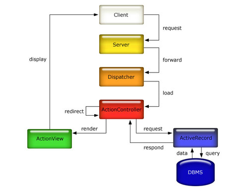
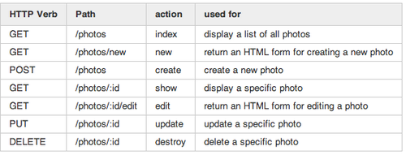

# Ruby / Rails interview Qs

What are ruby gems?

This is a very open ended question and you might be better of to start with the basics first:

- A gem is nothing more than a piece of ruby code packaged as a library so that it can be imported and used by others in their programs.

- A Ruby gem is therefore simply a library that is written in the ruby programming language.

- You can add that you often look for ruby gems on rubygems.org. If you have downloaded any recent gems it might be a good idea to mention those. Some of the popular Ruby gems that your interviewer will likely be faimilar with are:

> rails

> activerecord

> rake

> activeadmin

Finally Rubygems is the name of the project that wrote the “gem” ruby library. [You need not mention this during the interview]

## What is the difference between a Symbol and String?

Symbols and string are used interchangeably by various developers and their usage within gems can be confusing at times. You can think of Symbols as faster & immutable strings.

Once a string is used up it is marked for cleaning by the garbage collector but it is not cleaned up immediately and it cannot be reused.

Symbols live for the duration of the session. You might say that this leads to increased memory usage however by keeping the symbol alive a bit longer it can be reused again.

Here’s a terminal irb session that will provide more insight.

	puts :"I am a symbol".object_id
	457908

	puts :"I am a symbol".object_id
	457908

	puts :"I am a symbol".object_id
	457908

	puts "I am a string".object_id
	70343000106700

	puts "I am a string".object_id
	70343000094220
Notice that the object_id stays the same when symbols are created. This happens because the ruby interpreter uses the same heap memory location each time. The symbol was never completely released.

However, in the case of strings the memory is marked for cleanup each time and a new memory is allocated.

Another big difference is that strings can be modified. They are mutable.

So, this would work:

	puts "I am a string" << " for you"
	I am a string for you
However, symbols are immutable.

So, this would throw an error:

	puts :"I am a symbol" << :" for you"
	NoMethodError: undefined method `<<' for :"I am a symbol":Symbol

	from (irb):16
	from /Users/anilo/.rvm/rubies/ruby-1.9.3-p0/bin/irb:16:in `<main>'
	1.9.3p0 :017 > puts :"I am a symbol" << " for you"
	NoMethodError: undefined method `<<' for :"I am a symbol":Symbol

## What is the purpose of yield?

The interpreter essentially invokes a separate piece of code and places it in the location. You might say it is similar to a method calling another method. Let’s understand a little bit of background about where yield might be useful first.

The Rails framework encourages you to write code that is DRY (Don’t Repeat Yourself).

Developers often write common code in a central file and then they write the custom code in the specific files. Let’s say you are building a web application and you want all pages to have a common header, a common footer, the same “Welcome user-name!” message.

You can put all this common code in your application.html.erb file.

	<html> .... common page title
	.. standard header...
	<body>
	..common page title,
	 <%= yield %>
	..footer code can go here... </body>
	</html>
The rest of the custom code can go in your specific file. Say the page you are creating is the list of articles. Then in your implementation file you would just write the code for pulling in the articles and the final page displayed to the user would be your custom code which will be placed instead of the <%= yield %> code in the application.html.erb file.

## What are class variables? How do you define them?

Class variables are created using the @@ prefix to denote the variable as class level.

It works just like any other variable, however in the case of inheritance it works more like a static variable that is accessed across all variable instances.

Another example can be found here:

	class DemoClass
	 @@my_var = nil
	  def initialize
	    @@my_var = "hello world"
	  end
	  def my_var
	    puts @@my_var
	  end
	end
	class Demo2Class < DemoClass
	  def initialize
	    @@my_var = "goodbye world"
	  end
	end
	demo1 = DemoClass.new
	demo1.my_var
	demo2 = Demo2Class.new
	demo2.my_var
	demo1.my_var
	The output would be as shown below:
	hello world
	goodbye world
	goodbye world

This may appear strange at first, but really all it shows is that the variable my_var is shared across both object instances.

## How do you define instance variables?

Instance variables are defined using single @ symbol.

	@foo = "Hello"
Within a class they can be declared as below:

	class Animal
	 attr_accessor :name, :age
	end
Next you can query an object instance to find which instance variables it has.

	anim = Animal.new
	anim.instance_variables
	=> [ ]
	anim.name="John"
	anim.age = 3
	 => [:@age, :@name]
In the above case we did not put the @ symbol before the instance variables but it is implied.

## How do you define global variables?

Global variables are defined using single $ symbol.

	$foo = 5
It can be declared anywhere and used anywhere.

Generally you shouldn’t declare too many global variables but sometimes it makes sense to do so. One nice feature of a global variable is that it can be used to trigger a procedure if it’s value changes.

	trace_var :$foo, proc{puts "$foo is now #{$foo}"}
This set the tracking and the procedure is called whenever the value of $foo changes.

	$foo=7
	$foo is now 7
	 => 7
## Does Ruby support constructors? How are they declared?

Constructors are supported in Ruby. They are declared as the method initialize, shown below. The initialize method gets called automatically when Album.new is called.

	class Album
	  def initialize(name, artist, duration)
	    @name     = name
	    @artist   = artist
	    @duration = duration
	  end
	end
## How can you dynamically define a method body?

An instance method can be defined dynamically with

	Module#define_method(name, body),

where name is the method’s name given as a Symbol, and body is its body given as a Proc, Method, UnboundMethod, or block literal. This allows methods to be defined at runtime, in contrast to def which requires the method name and body to appear literally in the source code.

	class Conjure
	  def self.conjure(name, lamb)
	    define_method(name, lamb)
	  end
	end

Define a new instance method with a lambda as its body

	Conjure.conjure(:glark, ->{ (3..5).to_a * 2 })
	Conjure.new.glark #=> [3, 4, 5, 3, 4, 5]
`Module#define_method` is a private method so must be called from within the class the method is being defined on. Alternatively, it can be invoked inside class_eval like so:

	Array.class_eval do
	  define_method(:second, ->{ self. })
	end
	[3, 4, 5].second #=> 4
`Kernel#define_singleton_method` is called with the same arguments as `Module#define_method` to define a singleton method on the receiver.

	File.define_singleton_method(:match) do |file, pattern|
	  File.read(file).match(pattern)
	end
	File.match('/etc/passwd',/root/) #=> #<MatchData "root">

## What is a Range?

Range is a great way to declare continuous variables. You should use it to declare arrays and other types of collections.

	range1 = (1..4).to_a
	 => [1, 2, 3, 4]
	puts range1
	1
	2
	3
	4
You can also create strings in this format and it fills in the interim values automatically.

	range2 = ('bar'..'bat').to_a
	puts range2
	bar
	bas
	bat
Since the end result of using range is an array you can also iterate over it just like any other array.

	range2.each do |str|
	   puts "In Loop #{str}"
	end
This produces the result as shown below:

	In Loop bar
	In Loop bas
	In Loop bat
## How can you implement method overloading?

This one’s a tricky question. If you have a background in Java then you must know that method overloading is simply multiple methods with same name but different signatures/parameters.

In the case of Ruby method overloading is not supported.

However, it does support the overall goal of passing variable number of parameters to the same method. You would implement it like this:

	class MyClass
	  def initialize(*args)
	    if args.size < 2  || args.size > 3
	      puts 'This method takes either 2 or 3 arguments'
	    else
	      if args.size == 2
	        puts 'Found two arguments'
	      else
	        puts 'Found three arguments'
	      end
	    end
	  end
	end
The output can be seen here:

	MyClass.new([10, 23], 4, 10)
Found three arguments

	MyClass.new([10, 23], [14, 13])
Found two arguments
SO: You can get the same effect as method overloading but you just have to manage the number of variables inside your method itself.

## What is the difference between ‘&&’, ‘and’ and ‘&’ operators?

The ‘&&’ and ‘and’ are both logical and statements. They ‘&&’ operator has higher precedence though. Here’s an example of illustrate this in more detail:

	foo = 3
	bar = nil
	a = foo and bar
	# => nil
	a
	# => 3
	a = foo && bar
	# => nil
	a
	# => nil

Notice how the statement ‘a = foo and bar’ actually behaves like ‘(a = foo) and bar’

## How can you create setter and getter methods in Ruby?

The setter and getter methods can be created manually by the developer or it can be auto-generated by Ruby using the attr_accessor method specifier.

	class Animal
	   attr_accessor :name, :age
	end
	anim = Animal.new
	 => #<Animal:0x007f8ea20841d8>
	anim.age = 3
	 => 3
	anim.name = "Steve"
	 => "Steve"
	puts anim.name, anim.age
	Steve
	3

Of course you can achieve the same result by implementing all the setter and getter methods like this as well:

	class Animal
	  def name # this is the getter method
	    @name
	  end
	  def name=(name)  # this is the setter method
	    @name = name
	  end
	#...same for age...
	end

## What is the convention for using ‘!’ at the end of a method name?

The ! indicates that the method is about to change the object itself.

Here’s an example:

	foo = "A TEST STRING"  # a string called foo

	foo.downcase!     # modifies foo permanently
	a test string

	puts foo          # prints modified foo
	a test string

Similarly if you did not want the object to be changed you could have something simple like:

	foo2 = "A 2nd Test String"  # a string called foo

	foo2.downcase     # modifies foo temporarily
	a 2nd test string

	puts foo2 nbsp;    # prints original foo
	A 2nd Test String

## What is a module?

A module is like a class. Except that it can’t be instantiated or subclassed.

In OOP paradigm you would store methods & variables that represent variables in a single class. Say you want to create an Employee representation then the employee’s name, age, salary, etc. would all go inside a Employee class, in a file called Employee.rb

Any methods that act on those variables would also go inside that class.

You can achieve the same effect by putting all the variables and methods inside a Employee module:

	module Employee
	  ..variables.
	  ...methods
	end

The main difference between the class & module is that a module cannot be instantiated or subclassed.

Module are better suited for library type classes such as Math library, etc.

## Does Ruby support multiple inheritance?

Ruby does not support multiple inheritance.

## How can you achieve the same effect as multiple inheritance using Ruby? What is mixin?

Ruby offers a very neat alternative concept called mixin. Modules can be imported inside other class using mixin. They are then mixed-in with the class in which they are imported.
Here’s an example:

	module Debug
	  def whoAmI?
	    "I am #{self.to_s}"
	  end
	end

	class Photo
	 include Debug
	end

	ph = Photo.new

	"I am : #<Photo:0x007f8ea218b270>"

As you can see above the class Debug and it’s method “whoamI?” were mixed-in (added) with the class Photo.

That’s why you can now create an instance of the Photo class and call the whoAmI? method.

	ph.whoAmI?
	 => "I am : #<Phonograph:0x007f8ea218b270>"

## How will you implement a singleton pattern?

Singleton means single instance.

So, the goal of a singleton pattern is to write a class definition but only allow the creation of the single instance of that object.

This can be achieved nicely with the singleton gem as shown below:

	require 'singleton'
	 class Logger
	  include Singleton
	  def initialize
	    @log = File.open("logfile.txt", "a")
	  end
	  def log(msg)
	    @log.puts(msg)
	  end
	end

Adding the singleton as a mixin to the

	Logger.instance.log('This is just a test message')

The code above will create a single instance of Logger and simply put the message in the logger file.

Singleton patterns are mostly used for DB instance, Logger instance, etc. —- cases where there should be ONE and only ONE instance of the object that is used.

Sometimes you might like to actually hold on to the logger object and use it everywhere you can do so by the following command:

	logObj = Logger.instance
Notice you cannot use the Logger.new to create an object instance because this is a singleton object and therefore calling ‘new’ would fail.

## How will you implement an observer pattern?

Let’s review first what an observer pattern is all about.

The observer pattern (sometimes known as publish/subscribe) is a software design pattern in which an object, called the subject, maintains a list of its dependents, called observers, and notifies them automatically of any state changes, usually by calling one of their methods. It is mainly used to implement distributed event handling systems.

You might have used them in other programming languages as listener objects. You use them whenever a button is clicked on the screen and a method gets called automatically.

As in the case of the singleton pattern, the observer pattern is also implemented by mixing in a module.

In the Ruby implementation, the notifying class mixes in the Observable module, which provides the methods for managing the associated observer objects.

And, the observers must implement the update method to receive notifications.

Here’s an example. Say you want to send an SMS alert to users if a company stock drops then you can do something like this:

	require "observer"
	require "observer"
	  class Ticker # Periodically fetch a stock price
	    include Observable
	 	attr_accessor :price
	    def initialize symbol, price
	      @symbol = symbol
	  	@price = price
		end

		def run
	      lastPrice = nil
	      loop do
	        @price = @price+Random.rand(11)
	        print "Current price: #{price}\n"
	        if @price != lastPrice
	          changed                 # notify observers
	          lastPrice = @price
	           notify_observers(Time.now, @price)
	         end
	       end
	    end
	  end

	  class Warner
	     def initialize ticker
	     ticker.add_observer(self)   # all warners are observers
	  end
	end

	class SMSAlert < Warner
	   def update time, price       # callback for observer
	      print "--- #{time.to_s}: SMS Alert for price: #{price}\n"
	   end
	end

	class EmailAlert < Warner
	   def update time, price       # callback for observer
	      print "+++ #{time.to_s}: Email Alert Price changed to #{price}\n"
	   end
	 end

Now let’s initialize the classes and run them:

	ticker = Ticker.new("MSFT", 307)
	SMSAlert.new(ticker)
	EmailAlert.new(ticker)
	 ticker.run
	 Current price: 312
	 --- 2012-02-22 01:26:04 -0800: SMS Alert for price: 312
	 +++ 2012-02-22 01:26:04 -0800: Email Alert Price changed to 312
	 Current price: 321
	 --- 2012-02-22 01:26:04 -0800: SMS Alert for price: 321
	 +++ 2012-02-22 01:26:04 -0800: Email Alert Price changed to 321
	 Current price: 323
	 --- 2012-02-22 01:26:04 -0800: SMS Alert for price: 323
	 +++ 2012-02-22 01:26:04 -0800: Email Alert Price changed to 323
	 Current price: 329
	 --- 2012-02-22 01:26:04 -0800: SMS Alert for price: 329
	 +++ 2012-02-22 01:26:04 -0800: Email Alert Price changed to 329

## What is the purpose of environment.rb and application.rb file?

There are two files where variables and configuration settings are stored.

- config/environment.rb : Environment settings go here

- config/application.rb : Application level global settings go here

	config.time_zone = 'Central Time (US & Canada)'
	config.i18n.default_locale = :de
	config.filter_parameters += [:password] # ensures that passwords are not logged

The same file is also used for configuring various environment settings such as:

	config.action_mailer.smtp_settings # various email settings go here

What is the purpose of config/environments/development.rb file?

You would specify various config settings the development environment in this file.

	config.action_controller.perform_caching = false # to enable caching\

This is because you typically do not want to enable caching in the development environment.

The same config setting in the production environment would be equal to true.

## How can you define a constant?

Create a new file as shown below under: config/initializers/my_constants.rb

	COLORS = ['white', 'red', 'green']

## How can you define a custom Exception?

How can you fire a method when a module is included inside a class?

Fire a method inside a class is very simple.

Say you have a module file trig.rb:

	module Trig
	  PI = 3.141592654
	  def Trig.sin(x)
	   # ..
	  end
	  def Trig.cos(x)
	   # ..
	  end
	end
Now you simply import this module inside your class and invoke the method using the “module.method_name” syntax as shown below

	require "trig"

	class myclass
	y = Trig.sin(Trig::PI/4)

This type of invocation ensures that the right module method gets called.

## What is the default access modifier (public/protected/private) for a method?

By default all methods are public, except the initialize(constructor) method.

You can make methods private using this declaration within your class:

	class MyClass
	    def method_public_here
	    end
	    private# all methods that follow will be made private: not accessible for outside objects
	    def method_private_here
	    end
	  end

## How can you call the base class method from inside of its overridden method?

If you are inside the overridden method in the derived class then a simple call to super will call the right method in the base class

	class Parent
	   def try_this()
	      puts "parent"
	   end
	end

	class Child < Parent
	   def try_this()
	      super()
	      puts "child"
	   end
	end

	ch = Child.new
	ch.try_this()

This generates the output

	parent
	child

Now if you just want to call the base class without calling the derived class then the best way to do that is to simply assign an alias to the parent method like this:

	class Parent
	  def knox
	    puts 'parent'
	  end
	end

	class Child < Parent
	   alias_method :parent_knox, :knox
	   def knox
	     puts 'child'
	   end
	end

	ch = Child.new
	ch.parent_knox
	ch.knox

This allows you to call the base class method with the alias parent_knox and the derived class method knox can be called directly.

	parent
	child

# Rails Specific Questions

## Define the Rails MVC implementation using an example.

The MVC framework is an age-old architecture pattern that works very well for most applications. Rails has adopted the MVC pattern in its inherent design.

Stated Simply:

a) Model — is where the data is — the database

b) Controller — is where the logic is for the application

c) View — is where the data is used to display to the userimage

Let’s look at an example in Rails.

Here’s a very straight forward usage diagram for the MVC framework.

## What is scope? (or named_scope in Rails 2.x).

Scopes are nothing more than SQL scope fragments. By using these fragments one can cut down on having to write long queries each time you access content.

Say you typically access content as shown below:

	@posts = Post.where("published_at IS NOT NULL AND posts.published_at <= "+ Time.now)

Ruby offers you a nice way to put the where condition inside a scope statement as shown below.

	class Post < ActiveRecord::Base
	  scope :published, lambda {
	    { :conditions =>
	      ["posts.published_at IS NOT NULL AND posts.published_at <= ?", Time.now]
	    }
	  }
	  scope :recent, :order => "posts.published_at DESC"
	end

Now you can simply access the published posts as: Post.published

	@posts = Post.published

Also, you can access recent posts as

	@recent_posts = Post.recent

## Can you give an example of a class that should be inside the lib folder?

Modules are often placed in the lib folder.

## Where should you put code that is supposed to run when your application launches?

In the rare event that your application needs to run some code before Rails itself is loaded, put it above the call to require ‘rails/all’ in config/application.rb.

## What deployment tool do you use?

Capistrano is a popular deployment tool.

## How can you migrate your database schema one level down?

The rake tool does most of the migrations.

It has this nifty syntax to go back one step:

	rake db:rollback
If you want to rollback all the way to the beginning you would use:

	rake db:reset
This would drop the database, recreate the Database and load the current schema into it

If you want to rollback multiple steps at the same time you would use:

	rake db:rollback STEP=3
To rollback all the way and if you are not worried about losing the data then you can drop the database completely with purge like this:

	rake db:purge

## What is a sweeper?

Sometimes you want to have control over how often and when the cache expires.

Sometimes it is a good idea to have the system determine that on a logical basis. Say you have a list of product on your site and you want to reload the cache each time a new product is added/updated/deleted, then you can achieve this by using the sweeper.

	class ProductSweeper < ActionController::Caching::Sweeper
	  observe Product# This sweeper is going to keep an eye on the Product model
	  # If our sweeper detects that a Product was created call this
	  def after_create(product)
	    expire_cache_for(product)
	  end
	  # If our sweeper detects that a Product was updated call this
	  def after_update(product)
	    expire_cache_for(product)
	  end
	  # If our sweeper detects that a Product was deleted call this
	  def after_destroy(product)
	    expire_cache_for(product)
	  end
	  private
	  def expire_cache_for(product)
	    # Expire the index page now that we added a new product
	    expire_page(:controller => 'products', :action => 'index')
	    # Expire a fragment
	    expire_fragment('all_available_products')
	  end
	end

## How can you implement caching in Rails?

Rails offers multiple ways to cache content.

Fragment caching is my favorite because it gives you the choice to fragment to pull a portion from the cache and the remaining from a real-time DB call.

Say you wanted to show all the orders placed on your website in real time and didn’t want to cache that part of the page, but did want to cache the part of the page which lists all products available, you could use this piece of code:

	<% Order.find_recent.each do |o| %>
	  <%= o.buyer.name %> bought <%= o.product.name %>
	<% end %>
	<% cache do %>  All available products:
	  <% Product.all.each do |p| %>
	    <%= link_to p.name, product_url(p) %>
	  <% end %>
	<% end %>

Another technique that works well for static pages is page caching. This technique is often used for home pages and is super fast.

	class ProductsController < ActionController
	   caches_page:index
	  def index
	    @products = Products.all
	  end
	end

## What is a filter? When it is called?

Filters are methods that are called either before/after a controller action is called.

Say a user requests a controller action such as userdashboard/index

In such a case a filter can be setup so that the UserDashboard/index page is only accessible to loggedin users by adding the following lines towards the beginning of the page:

	class UserDashboardController < ApplicationController

	  before_filter :confirm_logged_in,  :except => [:login, :attempt_login, :logout]

	  def index
	      ....
	  end

	  def login
	      ....
	  end

	  def attempt_login
	      ....
	  end

	  def logout
	      ....
	  end

	end

In the code above the condition “confirm_logged_in” is checked before all actions, except login, logout & attempt_login.

After filters (after_filter) are not used too much but they have the effect of executing some code after a particular action has completed.

Think of them like triggers that get executed automatically — just like a database trigger.

## What do controllers do in Rails?

Once a request comes into the Rails stack, it goes to the routes table to determine which controller and action should be called.

Once a controller action is determined the request is routed to the controller and it does the needed processing by connecting with the DB if needed and then it sends control to the View to render the output.

So, really the flow for Rails goes somewhat like this:

Customer-> Routes-> Controller -> Model(DB) -> Controller -> View -> Customer

How can you divide your controllers into separate modules?

## What is RESTful routing?

Routing is fun. If you have ever dealt with IIS you will fall in love with RESTful routing. Here’s how it works.

Say you want your users to have access to certain pages such as:

	/photos/new

	/photos/1/edit

	/photos/1

And, you want the right controller to get called.

And, you want the right view to get rendered.

All this is made possible with a single entry in the routes.rb file as shown below:

	resources :photos

In Rails, a resourceful route provides a mapping between HTTP verbs and URLs to controller actions. By convention, each action also maps to particular CRUD operations in a database. The single entry in the routing file creates seven different routes in your application, all mapping to the Photos controller:

## How can you list all routes for an application?

	rake routes -- will display all routes for an application.

## How can you send a multi-part email?

Nowadays most email clients support HTML email, however there are still some old Blackberry phones that prefer emails the ‘ol text way.

Therefore it is important to send emails both as HTML and text. This technique is called multi-part emails.

The ActionMailer class (included in Rails 3.0) does a great job of sending both text and HTML emails out to the end user at the same time.

By default Rails sending an email with plain/text content_type, for example:

	# app/models/notifier.rb
	def send_email(email)
	  subject       email.subject
	  from          email.from
	  recipients    email.recipients
	  sent_on       Time.now
	  body          :email => email
	end

Next let’s update the view in : app/views/notifier/send_email.html.erb

	Welcome to here:

The sent email is a plain text email

	Date: Thu, 5 Aug 2010 16:38:07 +0800
	From: RailsBP
	To: flyerhzm@gmail.com
	Mime-Version: 1.0
	Content-Type: text/plain; charset=utf-8

	Welcome: http://rails-bestpractices.com

The link url is just displayed as a plain text because of the email content_type.

### text/html

If we want the email clients to display link url as html format, we should change the content_type to text/html in the app/models/notifier.rb file

	def send_email(email)
	  subject          email.subject
	  from             email.from
	  recipients       email.recipients
	  sent_on          Time.now
	  content_type     "text/html"
	  body             :email => email
	end

Now the sent email is a html formatted email

	Date: Thu, 5 Aug 2010 17:32:27 +0800
	From: RailsBP
	To: flyerhzm@gmail.com
	Mime-Version: 1.0
	Content-Type: text/html; charset=utf-8

	Welcome: http://rails-bestpractices.com

Now the email client can display the link url correctly with html format.

The email header looks somewhat like this:

	Content-Type: multipart/alternative;
	boundary="----=_NextPart_000_002C_01BFABBF.4A7D6BA0"
	Content-Type: multipart/alternative tells the e-mail program to expect different parts to follow, separated by a boundary which specified in quotation marks. Actually the boundary could be anything, though hyphens, equal signs, and underscores insure that the e-mail program won't try to display this boundary to the recipient.
	------=_NextPart_000_002C_01BFABBF.4A7D6BA0
	Content-Type: text/plain;
	charset="iso-8859-1"
	Content-Transfer-Encoding: 8bit

## What is the purpose of layouts?

Layouts are partial ruby/html files that are used to render the content pages.

There are placed in the folder: `app/views/layouts`

Items that you would typically put in this folder are things like headers/footers, navigation elements, etc.

Here’s a sample layout file: ``/app/views/layout/application.html.erb``

	<html lang="en">
	  <head>
	    <meta http-equiv="Content-Type" content="text/html; charset=utf-8">
	    <title>Learning System | <%= @page_title || 'Admin Area' %></title>
	    <meta name="author" content="Anil Punjabi">
	    <%= stylesheet_link_tag('public', 'admin', :media => 'all') %>
	    <%= javascript_include_tag('application') %>
	  </head>
	  <body>
	    

	      <h1>Learning System</h1>
	    

	    

	      <% if !flash[:notice].blank? %>
	      

	        <%= flash[:notice] %>
	      

	      <% end %>
	      

	        <%= yield %>
	      

	    

	    

	      
&copy; / Anil Punjabi

	    

	  </body>
	</html>

Say you are trying to access the page as shown below:

	http://mysite.com/page/index
Then the contents of the index.html.erb would be placed above in the section shown under <% yield %> above and sent back to the user.

### Is it possible to embed partial views inside layouts? How?

That is the purpose of layouts. You embed partial views inside the file `/app/views/layout/application.html.erb` and then whenever you render any page this layout is merged with it.

## What is the purpose of RJS?

## How can you create a REST API for your application?

## How can you define a new environment called ‘staging’?

## What is Rake?

Rake is a popular ruby gem that makes the job of running tasks simpler.

Rake is most often used for DB tasks, but it can be used for m

The common DB commands are:

	rake db:migrate
	rake db:reset

You can use cron to schedule rake tasks.

Sometimes you would create a `dataloader.rake` file and put it in the lib/tasks folder so that it can be used to populate the database on startup.

## What is Capistrano?

Capistrano is a popular deployment tool — it allows developers to push code from their desktop to the servers.

## What is a has and belongs to many association?

## What is the difference between has_one and belongs_to?

A has_one relationship is used to define a 1:1 relationship between two objects.

Examples are:

- A project has_one projectManager
- A sandwich has_one buyer
- A sandwich has_one seller

A belongs_to relationship on the other hand is used to define the reverse association for the same 1:1 relationship that is defined using the has_one keyword.

	class Employee < ActiveRecord::Base
	  has_one :office
	end

	class Office < ActiveRecord::Base
	  belongs_to :employee    # foreign key - employee_id
	end

The important thing to keep in mind is that you need to declare both associations in order for the relationships to work correctly.

## How can you implement single table inheritance?

## What is a polymorophic association?

A polymorphic association is what one would call “open-ended” association of one class with multiple objects.

Let’s say you have a generic class called “Picture”.

Now this “Picture” class might be used to store Pictures for Employees, Products and Dogs. They all have pictures and they all are associated to the Picture class.

Hence, this type of open-ended association is called “Polymorphic” association.

Let’s see how we can declare them.

	class Picture < ActiveRecord::Base
	  belongs_to :imageable, :polymorphic => true
	end

	class Employee < ActiveRecord::Base
	  has_many :pictures, :as => :imageable
	end

	class Product < ActiveRecord::Base
	  has_many :pictures, :as => :imageable
	end

	class Dog < ActiveRecord::Base
	  has_one :picture, :as => :imageable
	end

Notice that the Dog object has a 1:1 relationship with the Picture class, whereas the Product class has a 1:many relationship with the Picture class.

This capability prevents the headache of having of declare new classes for each new type of Picture.

The polymorphic relationship would look somewhat like this.

## What is eager loading?

Eager loading is a great optimization strategy to reduce the number of queries that are made against the DB.

Say you are finding 10 employees and then you are looking for their post codes. Then your query would appear something like this:

	clients = Client.limit(10)
	clients.each do |client|
	  puts client.address.postcode
	end

This may seem fine at first look but really this implementation leaves much to be desired. It makes 11 DB calls just to get the results.

Now you can optimize this query by making a slight change in the request like this:

	clients = Client.includes(:address).limit(10)
	clients.each do |client|
	  puts client.address.postcode
	end

This new request makes two SQL calls like this:

	SELECT * FROM clients LIMIT 10
	SELECT addresses.* FROM addresses
	    WHERE (addresses.client_id IN (1,2,3,4,5,6,7,8,9,10))

So, as you can see it really loads a lot more upfront and therefore it is called eager loading.

## How can you eager load associated objects?

## How does validation work?

Validation means checking to see if data  is good before it is stored in the database.

During signups and other such user input cases you want to check and be sure that the data is validated. In the past developers would often put this type of validation logic as triggers in the database.

In an MVC architecture one can do validations at each level.

You can do validations in the controllers but it is usually a good idea to keep your controllers skinny.

Views suffer from the javascript limitation because javascript can be disabled on the client side so they are not completely reliable.

The best way to manage validation is to put it in the model code. This model code is really the closest as you can be to the database and works very well for Rails applications.

Here are a few validation examples:

	class Person < ActiveRecord::Base
	  validates :name, :length => { :minimum => 2 }
	  validates :points, :numericality => { :only_integer => true }  # only integer
	  validates :age,  :numericality => { :greater_than => 18 } # greater than 18
	  validates :email, :uniqueness => true
	  validates :email, :confirmation => true  # this is to validate that the two email fields are identical
	  validates :email_confirmation, :presence => true # this is to validate that the email confirmation field is not nil

In your view template you may use something like this:

	<%= text_field :person, :email %> <%= text_field :person, :email_confirmation %>

## How can you add a custom validation on your model?

Now custom validations takes it to the next step.

Say you want to confirm that the data meets certain criteria

## How can you implement a custom theme for your forms?

## Why is fields_for used for?

## What is the purpose of a helper method?

## What is flash?

Flash  is simply a way to pass some value to the next action.

Anything you place in the flash will be exposed to the very next action and then cleared out.

Here’s an example:

	def destroy

	 section = Section.find(params[:id])
	 section.destroy
	 flash[:notice] = "Section destroyed."
	 redirect_to(:action => 'list', :page_id => @page.id)

	end

Then wherever you want to use the flash you can write this code. I often put this snippet in the application.html.erb file, somewhere towards the top:

	   <% if !flash[:notice].blank? %>
	         

	         <%= flash[:notice] %>

## How can you install the missing gems that are required by your application in the simplest way?

	bundle install
This command will install all dependencies and missing gems. It looks at your Gemfile to figure out what gems are needed by your application.

## How can you implement internationalization?

Ruby ships with i18n which is an internationalization gem.

You need to create locale files and save them under the config/locales directory as:

en.yml

es.yml

fr.yml

The keys should match for each of these files.

	en:   main_page:     hello: “Hello”     welcome: “Welcome to   My Company” es:   main_page:     hello: “Hola”     welcome: “Bienvenido a Mi Empresa” fr:   main_page:     hello: “Salut”     welcome: “Bienvenue à  Mon Entrepriseâ€

In your code you would need to specify that the text would be locale specific. So change it to something like this:

	.content   %h1     = t("main_page.hello")
	 %p     = t("main_page.welcome")

Then you have to select the actual locale.

More details here

## How can you configure your application for different environments?

## How can you instruct rails logger to ignore passwords and such fields while logging?

## Test Frameworks

Ruby on Rails has a number of built-in and a few other third-party test frameworks. Here are a few sample questions on such frameworks:

## Are you familiar with unit testing?

## How does functional testing differ from unit testing?

## Have you ever used a mocking framework?

## Are you familiar with BDD using RSpec or Cucumber?

## What is an alternative to using test fixtures?

## What plugin would you recommend for user authentication and authorization?

Devise works great with Rails.

It supports OAuth authentication and therefore integrates nicely with Facebook.

## What plugin do you use for full-text search?

Sunspot supports full-text search capability and uses Solr as the back-end search engine to do so.

You would include these two plugins in your gem file as shown below:

	gem 'sunspot_rails'
	gem 'sunspot_solr'
[More details here](https://github.com/sunspot/sunspot)

## How can you implement a state machine?

## What is the difference between a plugin and a gem?

A gem is just ruby code. It is installed on a machine and it’s available for all ruby applications running on that machine.

Rails, rake, json, rspec — are all examples of gems.

Plugin is also ruby code but it is installed in the application folder and only available for that specific application.

Sitemap-generator, etc.

In general, since Rails works well with gems you will find that you would be mostly integrating with gem files and not plugins in general. Most developers release their libraries as gems.

## How can you create a plugin?

You can read about how to create a rails plugin here:

[Plugin Guide](http://guides.rubyonrails.org/plugins.html)

## How can you implement a search feature that searches for multiple models?

If you are using acts_as_solr for your search you will be able to use multi_solr_search to enable search across multiple models.

Also, you can configure Sunspot/Solr to support search across multiple models. Here’s a [post](http://stackoverflow.com/questions/7947647/sunspot-solr-searching-with-multiple-fields) about it

Sphinx, another powerful search server can be used to search across multiple models and it works great.

## How can you upload a file to a server?

Paperclip is the best solution to manage file uploads to a server.

It can also help you with multiple file uploads and associate it with ActiveRecord.

There are also good examples online that show how you can make rotating sliders with the paperclip images.

Another nice solution is using carrier_wave gem.

The nice thing about carrier_wave is that it has good documentation on how to integrate with S3, Google & Rackspace for file storage.

You can achieve the same file storage capability with Paperclip as well though.

SEO Related Questions

## How can you generate sitemaps for your Rails site?

You can use dynamic_sitemaps gem to generate sitemaps

How can you show search user friendly urls instead of using only numeric ids?

The simplest way to do this is to use the gem FriendlyID.

It gives you the ability to specify a friendly URL for pages so that instead of the standard page URLs like:

http://mysite.com/page/1

You can build pages such as:

http://mysite.com/page/my-awesome-page-about-articles-and-content

## How can you create page titles and metadata for your pages?

You can use the Headliner plugin for adding page titles.

You can use the MetaMagic plugin to add meta tags.

## How can you create breadcrumbs on your pages?

Gretel is a great plugin to introduce breadcrumbs in your Rails application.

Another very simple implementation is breadcrumb_on_rails.

# Architecture Related Questions

This questions can be from different angles like: quality, security, scalability, manageability, interoperability, reusability and all the other ilities you name! Here are a few example questions:

## Is Rails scalable?

Yes Rails gives you complete freedom to use all traditional means of scaling an application. Things like memcached, caching full pages, caching fragments are all supported.

You can use any standard CDN to serve your media and static content as well.

Database scaling using sharding is supported.

Finally heroku makes your life easier by giving you the flexibility to scale up/down based on your need. Mostly websites have a peak time during which you need more servers and then there is a sleep time. Heroku makes that on-demand scaling process simpler. Companies such as HireFireApp.com makes the autoscale process easier.

## What are the key deployment challenges?

heroku makes deployment easy.

Things that I sometimes run into are:

> Mismatched gem versions between local and production environment

> Some lessons learned:

»» Use image_tag helper each time

»» Specify root path in ENV variable

»» Configure assets pipeline by setting: config.assets.enabled = true in the config/application.rb file

Configure Capistrano script to precompile assets

Here’s a nice video about [Assets Pipeline](http://railscasts.com/episodes/279-understanding-the-asset-pipeline?view=asciicast)

## How can you safeguard a rails application from SQL injection attack?

Rails already has the logic built into it to prevent SQL injection attacks if you follow the right syntax.

Say you are trying to authenticate a user based on their login and password you might be tempted to use a syntax as below:

	User.first("login = '#{params[:name]}' AND password = '#{params[:password]}'")
If an attacker enters ’ OR ‘1’=‘1 as the name, and ’ OR ’2’>’1 as the password, the resulting SQL query will be:

	 SELECT * FROM users WHERE login = '' OR '1'='1' AND password = '' OR '2'>'1' LIMIT 1
This will simply find the first record in the database, and grants access to this user.

To prevent this type of SQL injection simply use the following format.

	User.where("login = ? AND password = ?", entered_user_name, entered_password).first
OR

	User.where(:login => entered_user_name, :password => entered_password).first

## How can you secure a rails application?

Rails has a lot of in-built capabilities to deal with common web-security issues.

> SQL Injection

> Cross-Site

> Session fixation and Session hijacking

> Captcha

Follow this useful [security guide](http://guides.rubyonrails.org/security.html)

How can rails engage with a SOA platform?

Overall Community Questions

Can you tell me a few good community resources for Rails?

Stackoverflow, Github, various Meetup groups

Where would you reach out to get the community to answer your questions?

Stackoverflow and meetup groups.

What books can help me understand the basics of Ruby on Rails?

Best way to learn Ruby on Rails is to read every page from [Michael Hartl’s : Ruby on Rails Tutorial  Ruby on Rails](http://www.amazon.com/gp/product/0321832051/ref=as_li_tf_tl?ie=UTF8&camp=1789&creative=9325&creativeASIN=0321832051&linkCode=as2&tag=anilp0f-20)  and actually write code with each chapter. There’s no better way to learn than to actually code it !!!

For those that enjoy the visual way of learning things you might also enjoy the video series from Michael Hartl’s : Ruby on Rails Tutorial and LiveLesson Video Bundle

I used both to get a good grasp of the basics.

Everything else was just practice and networking with friends.

## What paths (HTTP verb and URL) will be defined by the following snippet in config/routes.rb?

	resources :posts do
	  member do
	    get 'comments'
	  end
	  collection do
	    post 'bulk_upload'
	  end
	end

### A

Using the resource method to define routes will automatically generate routes for the standard seven restful actions:

	GET /posts
	POST /posts
	GET /posts/new
	GET /posts/:id/edit
	GET /posts/:id
	PATCH/PUT /posts/:id
	DELETE /posts/:id

Note that Rails also supports the (relatively) new URL verb PATCH for partial updates to records. (In theory, a PUT request should only be valid if the entire record is included in the request.)

The extra routes defined inside of the block passed to resources will generate one route valid for individual posts (GET /posts/:id/comments) as well as one defined for the top-level resource (POST /posts/bulk_upload).

## What is the difference between Ruby’s Hash and ActiveSupport’s HashWithIndifferentAccess?
Hide answer
The Hash class in Ruby’s core library retrieves values by doing a standard == comparison on the keys. This means that a value stored for a Symbol key (e.g. :my_value) cannot be retrieved using the equivalent String (e.g. ‘my_value’). On the other hand, HashWithIndifferentAccess treats Symbol keys and String keys as equivalent so that the following would work:

	h = HashWithIndifferentAccess.new
	h[:my_value] = 'foo'
	h['my_value'] #=> will return "foo"

## What’s the problem with the following controller code? What would be the consequence of leaving this code in a production app? How would you fix it?

class MyController < ApplicationController
  def options
    options = {}
    available_option_keys = [:first_option, :second_option, :third_option]
    all_keys = params.keys.map(&:to_sym)
    set_option_keys = all_keys & available_option_keys
    set_option_keys.each do |key|
      options[key] = params[key]
    end
    options
  end
end

It’s dangerous to convert user supplied parameters to symbols, since Symbol objects in Ruby are not garbage collected. An attacker could send a series of requests with random keys that would be turned into symbols, quickly exhausting your server’s available memory and taking down your site.

There are two ways that this could be fixed. The first would be to use slice to eliminate values from the params hash that are not valid option keys. This would look something like:

	params.slice(*available_option_keys)
An alternative, some would argue better, option would simply be to use String keys for your options. Unless you have an extremely large number of possible option keys, you won’t actually save that much memory by using Symbol keys instead.

## What is CSRF? How does Rails protect against it?
View the answer →
CSRF stands for Cross-Site Request Forgery. This is a form of an attack where the attacker submits a form on your behalf to a different website, potentially causing damage or revealing sensitive information. Since browsers will automatically include cookies for a domain on a request, if you were recently logged in to the target site, the attacker’s request will appear to come from you as a logged-in user (as your session cookie will be sent with the POST request).

In order to protect against CSRF attacks, you can add protect_from_forgery to your ApplicationController. This will then cause Rails to require a CSRF token to be present before accepting any POST, PUT, or DELETE requests. The CSRF token is included as a hidden field in every form created using Rails’ form builders. It is also included as a header in GET requests so that other, non-form-based mechanisms for sending a POST can use it as well. Attackers are prevented from stealing the CSRF token by browsers’ “same origin” policy.

## How would you define a Person model so that any Person can be assigned as the parent of another Person (as demonstrated in the Rails console below)? What columns would you need to define in the migration creating the table for Person?

irb(main):001:0> john = Person.create(name: "John")
irb(main):002:0> jim = Person.create(name: "Jim", parent: john)
irb(main):003:0> bob = Person.create(name: "Bob", parent: john)
irb(main):004:0> john.children.map(&:name)
=> ["Jim", "Bob"]

## Create a route to be able to display pages with different information about different types of beer. The route should recognize URL paths like /beer/<beer_type> and should use the same controller action for each type of beer with the actually beer type passed into the controller action as a parameter. The valid beer types are:

-IPA
-brown_ale
-pilsner
-lager
-lambic
-hefeweizen

Any other type of beer specified should generate a 404 status code.
### A
One option would be to generate a simple get route that specifies the controller action to call and passes the kind of beer as a parameter:

	get 'beers/:kind' => 'beers#kind'
Then, within the context of the controller action, if the kind parameter is not included in the list of valid kinds, the action can raise a ActionController::RoutingError, which will redirect to 404 in production.

Alternatively, a simpler solution is to check against the list of valid kinds in the definition of the route. This can be accomplished using the constraints option as follows:

	kinds = %w|IPA brown_ale pilsner lager lambic hefweizen|
	get 'beers/:kind' => 'beers#kind', constraints: {kind: Regexp.new(kinds.join('|'))}

This code calls the BeersController#kind action method with params['kind'] set to a string representing the beer type given in the URL path. The key is using the constraints option for the route to specify a regular expression to use to verify the route is correct. In this case, the lambda checks to see that the kind parameter is included in the list of valid beer types.

Or perhaps an even better solution would be to use resource routing. This has the added benefit of providing URL generation helpers, but at the cost of requiring that the parameter name for the beer be passed as :id. This would look something like:

	kinds = %w|IPA brown_ale pilsner lager lambic hefweizen|
	resource :beer, only: [:show], constraints: {id: Regexp.new(kinds.join('|'))}

## How would you define a Person model so that any Person can be assigned as the parent of another Person (as demonstrated in the Rails console below)? What columns would you need to define in the migration creating the table for Person?

irb(main):001:0> john = Person.create(name: "John")
irb(main):002:0> jim = Person.create(name: "Jim", parent: john)
irb(main):003:0> bob = Person.create(name: "Bob", parent: john)
irb(main):004:0> john.children.map(&:name)
=> ["Jim", "Bob"]
And for a more advanced challenge: Update the Person model so that you can also get a list of all of a person’s grandchildren, as illustrated below. Would you need to make any changes to the corresponding table in the database?

irb(main):001:0> sally = Person.create(name: "Sally")
irb(main):002:0> sue = Person.create(name: "Sue", parent: sally)
irb(main):003:0> kate = Person.create(name: "Kate", parent: sally)
irb(main):004:0> lisa = Person.create(name: "Lisa", parent: sue)
irb(main):005:0> robin = Person.create(name: "Robin", parent: kate)
irb(main):006:0> donna = Person.create(name: "Donna", parent: kate)
irb(main):007:0> sally.grandchildren.map(&:name)
=> ["Lisa", "Robin", "Donna"]
### A
Normally, the target class of an ActiveRecord association is inferred from the association’s name (a perfect example of “convention over configuration”). It is possible to override this default behavior, though, and specify a different target class. Doing so, it is even possible to have relationships between two objects of the same class.

This is how it is possible to set up a parent-child relationship. The model definition would look like:

	class Person < ActiveRecord::Base
	  belongs_to :parent, class: Person
	  has_many :children, class: Person, foreign_key: :parent_id
	end
It’s necessary to specify the foreign_key option for the has_many relationship because ActiveRecord will attempt to use :person_id by default. In the migration to create the table for this model, you would need to define, at minimum, a column for the name attribute as well as an integer column for parent_id.

Self-referential relationships can be extended in all the same ways as normal two-model relationships. This even includes has_many ... :through => ... style relationships. However, because we are circumventing Rails’ conventions, we will need to specify the source of the :through in the case of adding a grandchild relationship:

	class Person < ActiveRecord::Base
	  belongs_to :parent, class: Person
	  has_many :children, class: Person, foreign_key: :parent_id
	  has_many :grandchildren, class: Person, through: :children, source: :children
	end
Consequently, since this is still just using the parent_id defined in the first case, no changes to the table in the database are required.

## What’s the issue with the controller code below? How would you fix it?

	class CommentsController < ApplicationController
	  def users_comments
	    posts = Post.all
	    comments = posts.map(&:comments).flatten
	    @user_comments = comments.select do |comment|
	      comment.author.username == params[:username]
	    end
	  end
	end
### A
This is a classic example of the notorious “n+1” bug. The first line will retrieve all of the Post objects from the database, but then the very next line will make an additional request for each Post to retrieve the corresponding Comment objects. To make matters worse, this code is then making even more database requests in order to retrieve the Author of each Comment.

This can all be avoided by changing the first line in the method to:

	posts = Post.includes(comments: [:author]).all
This tells ActiveRecord to retrieve the corresponding Comment and Author records from the database immediately after the initial request for all Posts, thereby reducing the number of database requests to just three.

Please note that the above answer is only one of a few ways that it is possible to avoid incurring an “n+1” penalty, and each alternative will have its own caveats and corner cases. The above answer was selected to be presented here since it requires the smallest change to the existing code and makes no assumptions regarding the reverse association of Comment to Post.