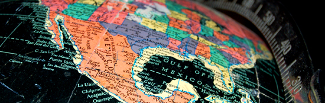

## [Google Maps on Rails](http://killswitchcollective.com/articles/65_google_maps_on_rails)

The Google Maps API is without a doubt one of the most popular APIs available on the web today. It offers webmasters the ability to add mapping functionality, similar to maps.google.com, to their websites. All of Google Maps functionalities, including markers, directions, zoom options and satellite view are only a few lines of code away. But before we get started with the code portion, you will need a Google Maps API key. Getting a Google Maps API key takes a minute and costs nothing. Just sign in to your Google Account (I am sure you have one) and head to http://code.google.com/apis/maps. On the right hand side you will see ‚How Do I Start, where you will just simply click on Step 1 "Sign up for a Google Maps API key". Then enter your site's live domain, accept the terms and click the "Generate API Key" button. On the next page your unique API key will appear. Make sure that you copy and paste it to a safe location. Below the API key will be JavaScript examples to quickly get you started. In this tutorial, we will generate similar code with the use of some rails plug-ins. The most popular plug-in is the Yellow Maps for Ruby, also known as YM4R. Since there are other mapping APIs, this plug-in comes in a few flavors. Since we're doing Google Maps, we will use YM4R/GM. 

1. Lets start by generating a new Rails application:

        rails map_example -d mysql
2. Create a '`map_example_development`' database and remove index.html from the public folder 

3. The lets add a controller and the index action

        ruby script/generate controller location index
4. Lets install the YM4R/GM plugin

        ruby script/plugin install git://github.com/queso/ym4r-gm.git

5. Add frontend.html.erb in app/views/layouts with the following code:

        <!DOCTYPE html PUBLIC "-//W3C//DTD XHTML 1.0 Strict//EN" "http://www.w3.org/TR/xhtml1/DTD/xhtml1-strict.dtd">
        
        <html xmlns="http://www.w3.org/1999/xhtml" xml:lang="en" lang="en">
        <head>
        	<title>Google Maps Rails Example</title>
        	
        	<%= GMap.header %>
        	<%= @map.to_html unless @map.blank? %>
        </head>
        <body>
        	
        <%= yield %>
        
        </body>
        </html>
Note that we have included two YM4R/GM lines in the head section. The `GMap.header` will include needed JavaScript files while the `@map.to_html` line generates JavaScript based on the parameters passed into the map object. We will be creating the @map object in our location controller. 

6. Don't forget to specify the layout in app/views/location_controller:

    layout "frontend"
7. Inside of the index action, add the following code:

        coordinates = [41.8921254,-87.6096669]
        
        @map = GMap.new("map")
        @map.control_init(:large_map => true, :map_type => true)
        @map.center_zoom_init(coordinates,14)
        @map.overlay_init(GMarker.new(coordinates,:title => "Navy Pier", :info_window => "Navy Pier"))
First we set our map coordinates into an array. The first number is the latitude and second is the longitude. These coordinates point to Navy Pier in Chicago, Illinois. If you would like to try a different area for this example, this easy tool ([http://stevemorse.org/jcal/latlon.php](http://stevemorse.org/jcal/latlon.php)) provides you the latitude and longitude for any address you want to use.. Next, we set the @map object to pass into our view. The @map object contains a new instance of the GMap class; the "map" string is the id of the div that will contain the map. The next line activates controls for our map. The large map activates the zoom option while the map type activates various views such as a regular map, satellite or terrain. Then we set the default map center and zoom. We first pass in the coordinates array so our location will be centered, then we pass in a integer to determine zoom level. This integer can be between 0 and 22, the higher the number the more the zoomed in the map will be. Finally, we add a marker overlay. The first argument is the coordinates and it is the only required argument need to add a marker. The title and info_window are both optional, title is the text that will display when your mouse is idle over the marker, while info_window is the text that will appear in the pop up box that appears after clicking the marker. 

8. Next open our view file located at app/views/location/index.html.erb and add the following:

        <h1>Google Maps Rails Example</h1>
        
        <%= @map.div(:width => 800, :height => 500) %>

9. Map the homepage to the index action of location by adding the following to config/routes.rb.

        map.root :controller => "location", :action => "index"
10. Fire up your rails application and a map should appear. Currently our map is static and the location can't change. It would be nice to have a option to change the location through a text field. Since it is a text field, the user will be able to type in any possible location and expect our application to map it. We're going to have to convert user-inputted text into map coordinates. Sounds complicated, luckily there is another rails plug-in that can be of help here and that plug-in is Google-Geocoder. Google Geocoder will find 11. Install the Google-Geocoder plugin:

        ruby script/plugin install git://github.com/tobstarr/google-geocoder.git

12. Next add the form to the bottom of the view:

         
        
        <% form_for "new_location", :url => location_index_path, :html => { :method => :post } do %>
        	<label>Enter a new Location to map:</label> 
        	<%= text_field_tag :new_location %>
        	
        	<%= submit_tag "Map It" %>
        <% end %>
13. We will then add the create action to the location controller:

        def create
        
        	new_location = params[:new_location]
        	
        	gg = GoogleGeocode.new("Your API Key Here")
        	gg_locate = gg.locate(new_location)
        
        	coordinates = [gg_locate.latitude, gg_locate.longitude]
        
        	@map = GMap.new("map")
        	@map.control_init(:large_map => true, :map_type => true)
        	@map.center_zoom_init(coordinates,14)
        	@map.overlay_init(GMarker.new(coordinates, :title => new_location, :info_window => new_location))
        
        	render :action => "index"
        end
A few lines of the create action is similar to the index action. First we set the new_location variable to the value of the new location parameter. Next we pass in the Google Maps API key to a new instance of the `GoogleGeocode` class, this will allow us to run methods such as "locate" which will return coordinate information. Then we set the coordinate array and the rest is familiar territory. The only difference is we are setting the title and info window text to the user input and finally we reuse the index template. That's it for my Google Maps on rails tutorial, we were able to get a functioning map by using the YM4R plug-in. Then we were able to map user-inputted locations by using the Google Geocoder plug-in. You could easily expand this example by giving the users the ability to map multiple locations at once or dry up similar code used in our index and create methods.